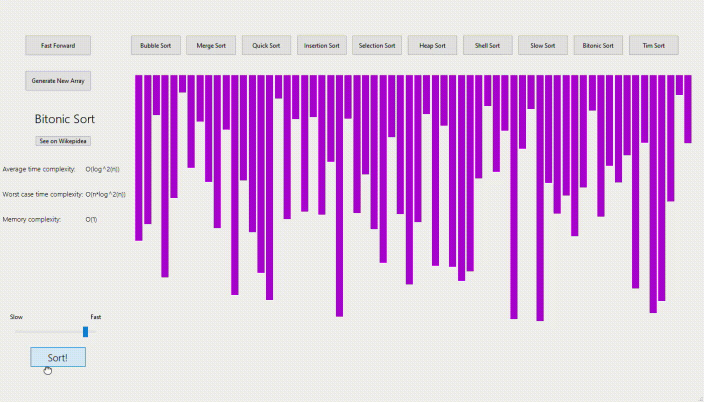

# Sort-Visualizer
 
SortVisualizer is a Qt tool to make visualization of 10 different sorting algorithms supporting:  
- Bubble sort
- Merge sort
- Quick sort
- Heap sort
- Shell sort
- Selection sort
- Tim sort
- Slow sort
- Bitonic sort
- Insertion sort

## Demonstration

### Quick sort:

### Heap sort:

### Bitonic sort:

### Slow sort:

